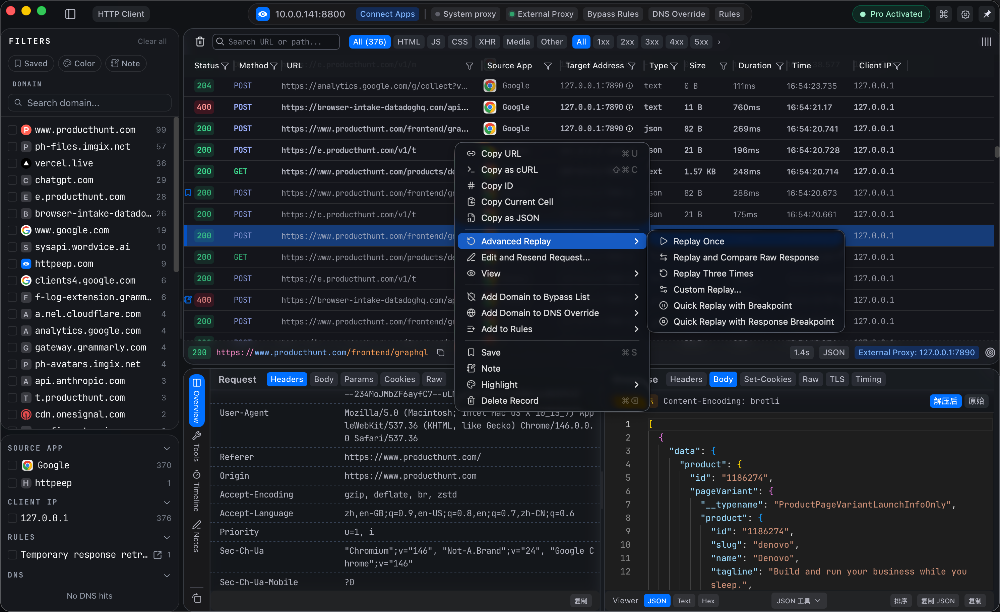
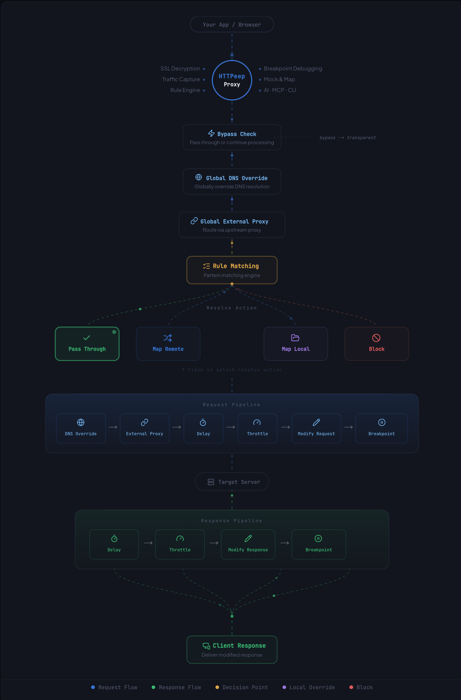
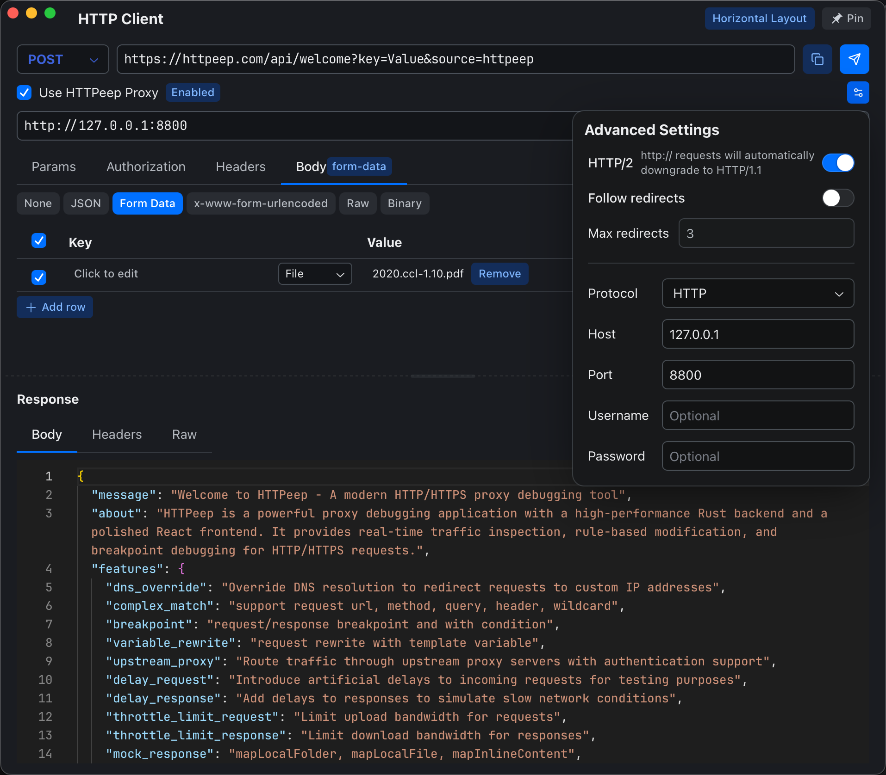
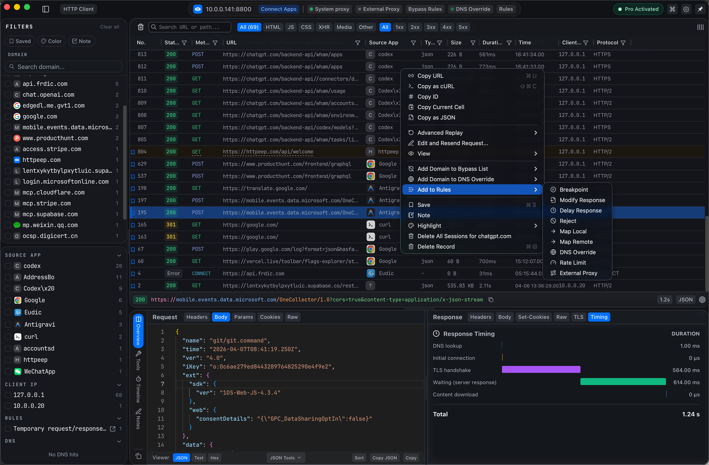
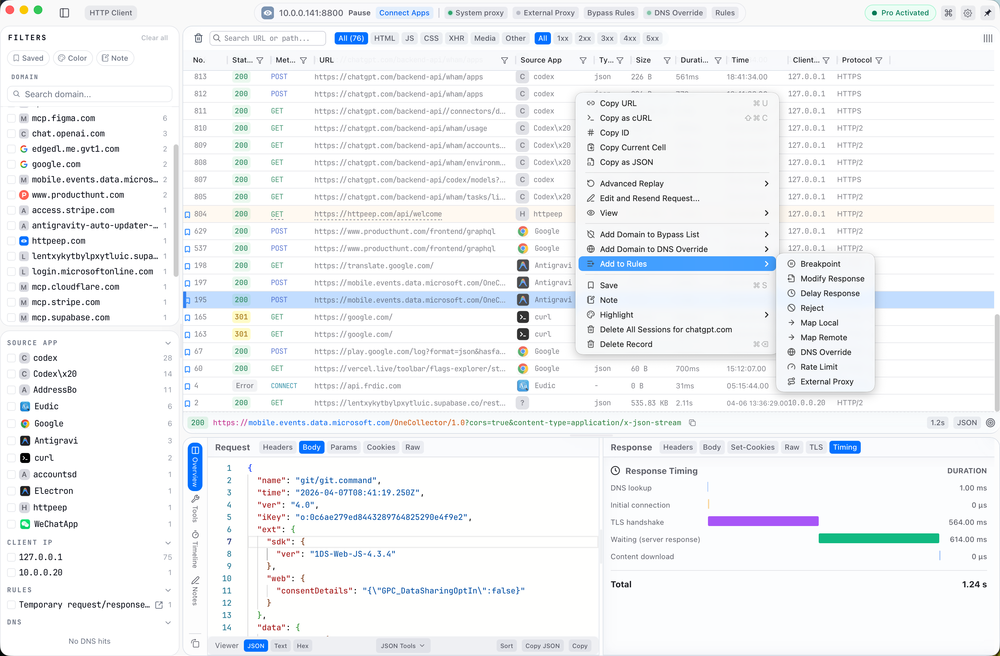

  

<h1 align="center">The Next-Gen HTTP/HTTPS Debugger & Programmable Proxy for Modern Developers.</h1>

  <strong>The Composable HTTP Debugger Stack rules to mock, intercept, and rewrite traffic — combine any actions, reuse anywhere.</strong>

  
  
  
  
  
  

---

  

  <video controls width="250">
  <source src="https://s1.httpeep.com/video/demo.mp4" type="video/mp4" />
  </video>

## About HTTPeep

HTTPeep is a fast, reliable, and developer-friendly HTTP/HTTPS debugging proxy built from the ground up with Rust. It captures, inspects, and modifies network traffic with a clean, professional interface. Whether you are debugging complex APIs, setting up mock servers, or rewriting requests on the fly, HTTPeep provides a powerful, composable toolset to handle your web traffic effortlessly.

> **Note**: This repository is for **bug reports** and **feature requests** only. For product information, visit [httpeep.com](https://httpeep.com).

## 🚀 Download

| Platform | Download | Requirements |
|----------|----------|--------------|
| **macOS** | [Download for macOS](https://httpeep.com/download) | macOS 10.15+ |
| **Windows** | [Download for Windows](https://httpeep.com/download) | Windows 10+ |
| **Linux** | [Download for Linux](https://httpeep.com/download) | glibc 2.31+ |

## ✨ Core Features

### 🔍 Traffic Capture & Inspection
HTTPeep seamlessly captures HTTP/1.1, HTTP/2, and HTTPS (MITM) traffic. It automatically groups requests by TCP connection, visualizes HTTP timing, and provides multi-dimensional filtering to easily locate the requests you care about.

  

### 🛠️ Advanced Rule Engine Arch
The true power of HTTPeep lies in its composable rule engine. Match traffic by domain, path, headers, or method, and build an action pipeline to Map Local, Forward, Delay, or Reject. Create robust rules, combine multiple actions, and export them to share with your team.

  

### 📡 Built-in HTTP Client
Need to test an endpoint directly? Use the integrated HTTP client to manually construct requests, test APIs on the fly, and even import your cURL or Fetch commands instantly.

  

### 🌗 Beautiful Native Themes
We care about aesthetics as much as performance. Choose between meticulously crafted light and dark themes that fit perfectly into your OS environment.

  
  

### 🤖 AI-Native Integration
HTTPeep features a Built-in MCP Server designed for AI agents. It works flawlessly with tools like Claude, Cursor, GitHub Copilot, and includes a CLI for scripted operations and CI/CD integration.

### And More...
- **Breakpoint Debugging** — Set breakpoints to modify headers, body, and status code on the fly.
- **Certificate Management** — Built-in CA for fast, frictionless HTTPS interception.
- **Custom DNS** — Override DNS resolution on a per-domain basis.
- **Export Capabilities** — Save your sessions in JSON, HAR, or PCAP formats.

## 🛠️ How It Works

| Step | Action | Description |
|------|--------|-------------|
| 1 | **Install & Trust Certificate** | Install HTTPeep and trust the built-in root CA certificate |
| 2 | **Capture Traffic** | Start the proxy to capture HTTP/HTTPS traffic from your apps |
| 3 | **Configure Rules** | Set up matching rules, breakpoints, and forwarding |
| 4 | **Debug & Modify** | Inspect requests/responses, modify on the fly, and solve issues |

## 💬 Feedback & Support

We'd love to hear from you! Here's how to reach us:

- **Bug Reports** — [Open an issue](https://github.com/HTTPeep/httpeep/issues/new?template=bug_report.md)
- **Feature Requests** — [Open an issue](https://github.com/HTTPeep/httpeep/issues/new?template=feature_request.md)
- **Community** — [Join our Discord](https://discord.gg/hWS5X2Hyqj)
- **Email** — support@httpeep.com
- **Updates** — Follow [@nichenqin](https://x.com/@HTTPeep001) on X

## ❓ FAQ

<strong>Is HTTPeep free?</strong>

HTTPeep offers a free tier with core features. See [pricing](https://httpeep.com/pricing) for details on premium plans.

<strong>Which platforms are supported?</strong>

macOS 10.15+, Windows 10+, and Linux (glibc 2.31+).

<strong>Where is my data stored?</strong>

All data is stored locally on your machine at `~/.httpeep/`. Nothing is sent to external servers.

---

  <a href="https://httpeep.com">httpeep.com</a>

  Made with ❤️ by the HTTPeep Team

